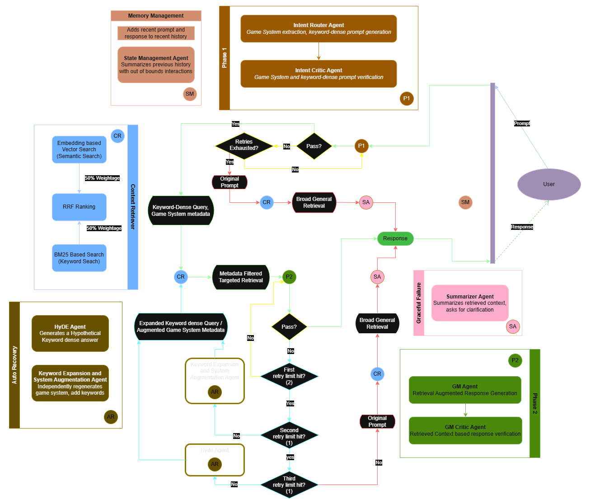

# Modron: Multi-Agent RAG Orchestration System for TTRPGs


**A stateful, self monitoring multi-agent orchestration system built with LangGraph and LangChain which features a decoupled data ingestion pipeline and an advanced RAG architecture that utilizes iterative LLM reflection, hybrid retrieval (BM25 + Chroma), and autonomous recovery (HyDE & Keyword Expansion) to enforce factual accuracy across dense, overlapping knowledge bases of Table Top RPG documents.**

[](https://www.python.org/downloads/)
[](https://python.langchain.com/docs/langgraph)
[](https://ollama.com/)
[](https://github.com/DS4SD/docling)
[]()
[](https://opensource.org/licenses/MIT)


> ***What is a Modron?***
>
> *In Dungeons & Dragons lore, Modrons are biomechanical beings from the plane of Mechanus. They represent absolute order, logic, and rule-following—a perfect mascot for an AI system designed to bring strict, mechanical order to chaotic, unstructured data.*
---

## Executive Summary 

Modron was built help break down the steep learning curve of Tabletop Roleplaying Games (TTRPGs) for new players. Rather than relying on basic API wrappers, this project was developed as a "learn-through-building" initiative to master production-grade Retrieval-Augmented Generation (RAG) architectures. The primary goal was to dissect why RAG systems are highly demanded in enterprise environments, identify the exact failure points of naive semantic search, and build a robust, stateful orchestration layer using LangChain and LangGraph to solve them.

While currently scoped as an AI Game Master for personal campaigns, the underlying architecture is deeply modular and designed to scale into a deliverable application capable of handling any dense, complex, cross-referencing knowledge base.

**The Engineering Problem:** *The "Asymmetric Retrieval" Trap* -
Standard RAG pipelines can fail catastrophically when applied to TTRPG rulebooks. These texts are infamous for being dense, heavily formatted with multi-column layouts and nested tables that are designed to be pleasant and easy to read for humans. Moreover, TTRPGs are plagued with overlapping terminology across games (e.g., "Armor Class" or "Spellcasting" that occur in both DnD and Pathfinder).

If a user asks a naive RAG system, "How do sneak attacks work?", a standard semantic search will retrieve a chaotic, blended context of rules from D&D, Pathfinder and Cyberpunk, causing the LLM to hallucinate a non-existent ruleset.

**The Solution:** To resolve this, Modron introduces a resilient Multi-Agent Routing LangGraph Pipeline that favours cyclical, multi-agent reflection loops:

1. **Intent Routing:** A fast local LLM intercepts the query, strips conversational filler to create a keyword-dense prompt, and identifies the target game system using both the immediate prompt and contextual chat history.
2. **Intent Critique:** A secondary evaluator Agent checks the routed intent. If confidence is low, the query is routed back for re-evaluation. Upon exhausting retries, it triggers a graceful failure state, pulling general context from games in database to generate summaries while ask the user for clarification.
3. **Hybrid RRF Retrieval:** Isolated by strict metadata filtering, the system uses a 50/50 Reciprocal Rank Fusion of dense semantic search (ChromaDB) and exact keyword matching (BM25).
4. **Generation & Hallucination Critique:** A heavy generation LLM drafts an answer, which is immediately audited by a strict Critic LLM to check for contextual accuracy and prevent hallucinated answers.
5. **Autonomous Recovery (Deep Reflection):** If the Critic detects a hallucination, the system does not simply fail. It triggers a recovery workflow, invoking specialized agents to perform Keyword Expansion, System Re-Evaluation, and HyDE (Hypothetical Document Embeddings) to artificially generate new semantic vectors and re-attempt retrieval.
---
## Architecture


<figure>
    
    <figcaption style="text-align: center; font-style: italic; font-size: 0.9em; color: gray;">
        Figure 1: System Logic Diagram
    </figcaption>
</figure>

---

## Advanced RAG Mechanics & Autonomous Recovery

Modron uses specific mechanisms to ensure precise retrieval without cross contamination across multiple game systems and autnomous recovery from potential hallucinations.

**1. Dynamic Metadata Isolation**
In TTRPGs, terms like "Action," "Attack," and "Rest" exist in almost every rulebook but have entirely different definitions or mechanical implementations. To prevent blending of context, the retrieval engine never performs a global search.

- The Routing/Intent Agent extracts the specific game system intent from the user's query while stripping away conversation fillers resulting in a clean, keyword dense query.
- The Database Manager applies a strict hardware-level metadata filter based on the game system to the ChromaDB query.
 
This effictively isolates game related documents, constricting the vector search space and prevents the system from retrieving wrong information.

**2. Hybrid Retrieval Engine**
Since responding to a TTRPG query requires both conceptual understanding ("How does wisdom checks work?") and keyword precision (if the user asks about a specific spell like "Resilient Sphere"), Modron uses a hybrid two-engine search approach.

- Dense Semantic Search: Currently utilizes  BAAI/bge-small-en-v1.5 embeddings via ChromaDB to find conceptually relevant chunks, even if the user paraphrases the mechanics.

- Sparse Keyword Search (BM25): An exact-match algorithm that builds an in-memory index strictly on the isolated game system documents, ensuring highly specific nouns (like "Multiattack" or "Resilient Sphere") are never missed.

Finally, the results from both Engines are combined using Reciprocal Rank Fusion, weighted equally. This ensures that the best ranked document carries semantic similarity and the exxact keywords.

**3. Hallucination Auditing**
Modron employs a strict "Generation and Critique" cycle to enforce factual accuracy.

- The Game Master (GM) Agent drafts an initial response based on the retrieved context, user prompt and chat history.

- The GM Critic Agent immediately audits this draft. It acts as an adversarial evaluator, checking if the GM introduced any mechanics, terms, or rules not explicitly present in the retrieved chunks.

- If a hallucination is detected, the draft is rejected, and the system attempts to generate a corrected response.

**4. Autonomous Recovery & Deep Reflections**
When standard retrieval fails to provide sufficient context, or the GM Agent repeatedly hallucinates, Modron does not crash. It triggers an autonomous recovery workflow:

- Keyword Expansion & System Re-Evaluation:  Agent/s re-analyze the query and chat history. They may adjust the targeted game system or independently generate a broader set of keywords (e.g., expanding "sneak attack" to include "flanking," "advantage," and "rogue features") to cast a wider net during the next retrieval attempt.

- Hypothetical Document Embeddings (HyDE): If standard methods fail, the HyDE Agent hallucinates a hypothetical ideal answer to the user's query. This hypothetical answer, rich in relevant vocabulary, is then vectorized and used to search the database, often matching relevant chunks dure to keyword density that the original, shorter query missed.
---

## Evaluation and Observations

The system was evaluated using System Rule Documents from four games, namely: Dungeons and Dragons, Pathfinder, Blades in the Dark and Laser and Feelings. The first set of tests were done using independent queries to the LLM. These test results are available in [tests/independent](tests/independent) section with the output of the graph updates stored in [graph_out.txt](tests/independent/graph_out.txt). 

A custom LLM-as-a-judge test framework inspired by RAGAS was also used to evaluate the model using a contrived reference dataset to overcome the lack of reference data due to issues like licensing restrictions and subjective rule interpretations. The evaluation results are provided in [test/llm_judge](tests/llm_judge) in the [evaluation.json](tests/llm_judge/evaluation_results.json) file.

> Note:
>- Since the project was developed locally, the model used for almost all systems was [*Qwen3.5 with 8B*](https://qwen.ai/blog?id=qwen3.5) parameters (due to local hardware bottleneck). However, the ModelManager ([graph_models.py](src/graph/graph_models.py)) allows for customizing different models/api calls for various agents used for fine tuning.
>- The evaluation results were generated with the help of Google's [*Gemma 4 with 31B*](https://deepmind.google/models/gemma/gemma-4/) parameters (API Calls)


**Performance Highlights:**

- Ruthless Critic: In Test 5 (Death Saving Throws), the Generation LLM subtly invented the phrase "fate system" which was not wildly wrong, but it wasn't in the text. The Critic caught it, failed it, and the GM successfully rewrote the response without the hallucinated term on Attempt 2.

- Graceful Degradation: In Test 4 (Flashbacks in D&D), the system routed to D&D (as it was specifically mentioned in the prompt), but the retrieval pulled irrelevant data because D&D doesn't have flashback mechanics. Instead of making something up, the GM safely admitted it didn't have the rules and asked for clarification.

- Multi-System Handling: For Test 13 (DnD Falling Damage + Lasers & Feelings)  the system successfully identified two distinct intents, routed to both databases, retrieved context for both, and the GM synthesized a highly readable, bipartite response.

- The Disambiguation Fallback: In Tests 1, 2, and 12, when a query was too broad, the Failsafe accurately triggered the Summarizer, which read the top chunks from all systems, generated a general summary and asked the user to clarify.

- High Precision on Complex Logic: When the retrieval successfully grabs the right chunk, generation model is incredibly sharp. RAGAS Tests 6 (Resilient Sphere) and 7 (Time Stop) require the LLM to parse highly specific, conditional logic and the generator synthesized this without losing mechanical accuracy, scoring perfect 1s.


**Bottlenecks**

- Critic Prompt Misalignment: There is a conflict between Router /Intent Agent and Critic Agent regarding how to handle queries that do not specify a game system (Tests 1, 6, and 12).

- The Generation LLM's "Pre-training Bias": In Tests 9 (D&D Monk) and 10 (Pathfinder Sneak Attack) the generation agent is ignoring the retrieved context and relying on its pre-trained knowledge. The Critic rightfully blocks it, but the Generator is too stubborn to drop the outside knowledge on subsequent retries. Similarly in RAGAS Test 2 (Laser and Feelings), it relied on its pre-training rather than strictly adhering to the context.

- Cross-Pollination of Rules: In RAGAS Test 9 (Pathfinder Sneak Attacks), the retriever failed to find the specific rule. Instead of triggering the graceful failure state, the LLM tried to answer anyway and hallucinated D&D flanking penalties and applied them to Pathfinder.

- The Chunking Limitation Confirmed: Test 5 (Damage Resistances) missed the specific interaction between fire and magic resistance. This validates a known limitation of the V1 pipeline: standard recursive character splitting is fracturing dense, overlapping mechanics, causing the retriever to miss the nuanced interactions between different rules.

---

## Installation and QuickStart

Modron relies on local execution for both data parsing and orchestration. Follow these steps to configure your local environment.

### Prerequisites
* **Python 3.10.4** (Strictly required for dependency mapping).
* **Ollama** (Required to serve local open-weight models). [Download Ollama here](https://ollama.com/), [Ollama Quickstart Here](https://docs.ollama.com/quickstart).

### Step 1: Clone the Repository


### Step 2: Automated Environment Setup
To ensure all dependencies (including LangGraph, ChromaDB, and IBM Docling) are installed correctly, run the provided setup script for your operating system.

**For Windows:**
```dos
setup.bat

```

**For macOS / Linux:**
```bash
chmod +x setup.sh
./setup.sh
```

### Step 3: Activate the Environment
Once the setup completes, activate the virtual environment:

- Windows: `.venv\Scripts\activate`

- macOS / Linux: `source .venv/bin/activate`

### Step 4: Local Model Configuration (OPTIONAL)
Unless you plan to use non local LLM models / agents, Pull the required models into your local Ollama instance before running the Jupyter Notebooks:

```bash

ollama pull qwen3.5:8b 
```
Or any other model that can run locally, based on hardware. Requires update to [graph_models.py](src/graph/graph_models.py)


---

## Known Limitations & Future Work

While Version 1.0 successfully implements a multi-agent RAG architecture with robust intent routing, testing revealed a specific limitation regarding high-density hierarchical data contained in most TTRPG rulebooks. 

**Current Limitation: Context Fragmentation & Data Overload**
Standard semantic chunking (`RecursiveCharacterTextSplitter` via Markdown headers) occasionally splits large, complex mechanics (like spell lists or class features) arbitrarily. This either strips vital context from the chunk or, if chunk sizes are increased too much, overloads the LLM's context window during retrieval, causing pipeline crashes. Furthermore, recursive splitting can fracture tabular data (e.g., weapon tables), separating column headers from their data rows.

**Planned Architecture for v2.0:**
To achieve enterprise-grade retrieval precision, the following pipeline upgrades are planned for the next release:
1. **Parent-Child Retrieval:** Implementing a dual-chunking strategy where ChromaDB searches highly granular "Child" chunks (for exact semantic precision) but passes the linked, comprehensive "Parent" chunk to the LLM (to maintain narrative and mechanical context).
2. **Regex-Based Table Shielding:** Adding a preprocessing pipeline step to identify and extract Markdown tables prior to chunking, injecting them back into the parsed chunks to preserve structural integrity for data-heavy queries.
3. **Context Window Management:** Introducing a token-aware reranker post-retrieval to ensure the context passed to the generation node never exceeds the local LLM's maximum limits.